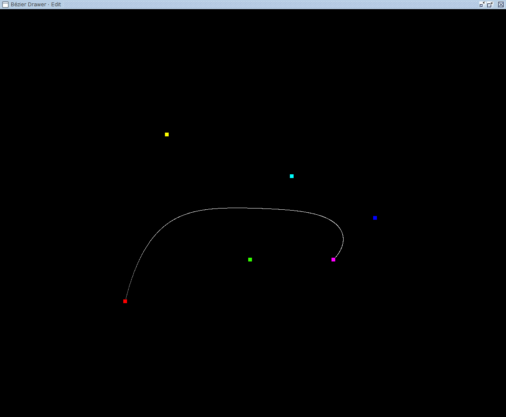
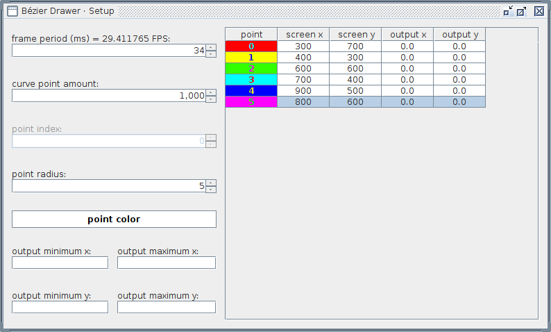

# Bézier Drawer

I wasn't happy with the [Bézier curve](https://en.wikipedia.org/wiki/B%C3%A9zier_curve) tools available in many graphics editors, specially because several of these use the name "Bézier curve" for splines, so I decided to make my own.

The program opens two windows. The first one, called "Edit", displays the curve and its control points.

Clicking in this window creates new control points, located at the end of the control point list. The points can be dragged with the mouse. Right clicking in this window brings up a popup menu with more options. If a point has been right clicked, the menu will have the options to remove that point, set its color, position and radius. If elsewhere was clicked, it's possible to add a point at a specific index in the list, set the background to a solid color or a picture and set the curve's color.

This window needs to be initialized by pressing a button, so the program knows what's the screen size available for drawing. I've found it difficult to do this programatically.

The second window, called "Setup", allows the manipulation of a few runtime parameters and shows control point data in a table.

This window allows to change the other window's frames per second (by setting the frame duration in milisseconds), how many curve points are drawn, the radius and color of new control points, and a desired output range. After the user inserts the desired minimum and maximum values for each coordinate, each control point's coordinates are converted to a linear scale, where 0 corresponds to the minumum desired value and the display area's width/height correspond to the maximum desired value.

The table displays each control point's index, color, screen coordinates and desired range coordinates.

## Future work

I wanted to have better control over where in the point list the new points are inserted. However, I started to realize that there are several different options I would have to provide, and it would take a lot of coding time for a non functional requirement. So I decided to implement it later. The most generic way I thought was to implement a spinner where you choose the index where the new point will be inserted, and a check box that makes this index be counted from the last position. For example, you could always insert a new point at the first index, at the second index, at the third index, and so on, or at the last index, at the second to last index, at the third to last index, and so on. Besides having to update the spinner's model's maximum value at every point insertion and removal, I might have to update the spinner value at every point insertion or removal when counting from the last, unless I use the value displayed and simply count from the last.

I also want to allow changing the control point's coordinates via the table, including via the desired range values, changing a point's index in the list, curve thickness and maybe more.

[A few words about Maven.](https://gist.github.com/GuiRitter/1834bd024756e08ab422026a7cd24605)
